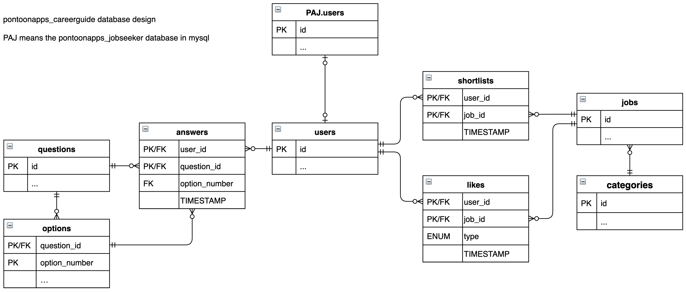

# PONToon Career Guide

Career guide is a tool designed to inspire job seekers using a content based recommender system to display jobs based on what suits that job seeker best.

## Installation

To run the app the database must first be set up.

### Setting up the database

Create a copy of career-guide/server/config-template.json to career-guide/server/config.json

## Installation

* install as a Node.js app: `npm install`
* to set up a local DB for testing, use `npm reset-db` (requires MySQL); in hosting, set up the database as appropriate using the scripts in `server/database`.
* copy `server/config-template.json` into `server/config.json` and update
  * `mysql` is straightforward connection details for the database
  * `DEPLOYMENT_ROOT` – the path at which the server lives (for testing it can be `/`, at pontoonapps.com it is `/career-guide/`)
  * `LOGIN_CHECK_URL` – the path to the cookie auth check PHP script (at pontoonapps.com it is `https://pontoonapps.com/is_logged_in.php`)
* to run, use `npm start`

On pontoonapps.com, the hosting platform does `npm install` and `npm start` for us.

## Design

The API is defined in docs/routes-and-auth.md

#### ERD


Set the attributes in the newly created config.json file to match your database and server.

Next run the following sql scripts to initialize the database:

1. `career-guide/server/database/init.sql`
2. `career-guide/server/database/data-jobs.sql`
3. `career-guide/server/database/data-questions.sql`
4. `career-guide/server/database/test-data.sql` (Only required for testing, not deployment)

## Design

### File structure

```
├── career-guide/
│  ├── client/                   // resources for the client side (images JS CSS HTML)
│  ├── docs/                     // documentation files (not including readme)
│  ├── server/                   // all server side resources
│  │  ├── database/              // all resources required to setup and run the database
│  │  │  ├── migrations/         // TODO Jack what does this folder do?
│  │  │  ├── data-jobs.sql       // jobs data
│  │  │  ├── data-questions.sql  // questions data
│  │  │  ├── init.sql            // creates databases
│  │  │  ├── reset-db.sh         // script to reset database (drops tables)
│  │  │  └── test-data.sql       // script containing limited data for testing
│  │  ├── auth.js
│  │  ├── config-template.json   // template file for requirements specific to deployment
│  │  ├── server.js              // script containing all routes
│  │  └── storage.js             // script containing all functions which run SQL
└──└── README.md
```

### Database

#### ERD

