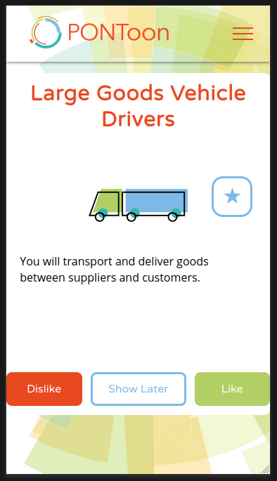
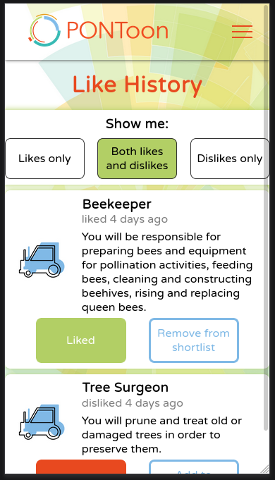
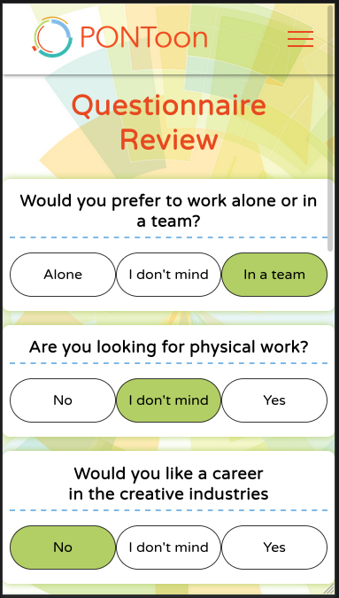
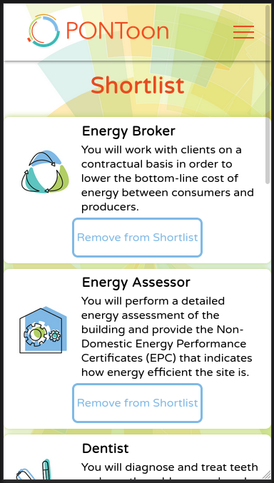

# Routes

| Label | Method | Route           | Description                                          |
|-------|--------|-----------------|------------------------------------------------------|
| A     | GET    | /user/next-item | Get an item to be swiped                             |
| B     | GET    | /user/jobs      | Get jobs a user has swiped on                        |
| C     | POST   | /user/jobs      | Submit a job swipe                                   |
| D     | GET    | /user/questions | Get questionnaire questions which have been answered |
| E     | POST   | /user/questions | Submit a questionnaire answer                        |
| F     | GET    | /user-id        | May include guest:true                               |
| G     | POST   | /guest-login    | Post nothing to create guest account on client side  |
| H     | POST   | /guest-logout   | Post nothing to remove guest account on client side  |

# Pages

## Next Job Page



### Routes Used:

When used to display jobs

+ **(A)** Get from the server, the next job to display to the user
+ **(C)** Send to the server, the user's answer to the job (dislike, like or show later)

When used to display questions

+ **(A)** Get from the server, the next question in the questionnaire
+ **(E)** The user's answer to the current question

## Like History Page



### Routes Used:

+ **(B)** Get from the server, all the jobs the user has already liked / disliked
+ **(C)** Send to the server, changes to the like history

## Questionnaire Review Page



### Routes Used:

+ **(D)** Get from the server, all the questions the user has already answered and their answers
+ **(E)** Send to the server, changes to the questionnaire answers

## Shortlist Page



### Routes Used:

+ **(B)** Get from the server, all the jobs the user has already liked. These will be filtered to show only shortlisted items on the client side
+ **(C)** Send to the server, removals from the shortlist

# Schemas and Examples

## Route A
*Get an item to be swiped*

Used on:
+ Next Job Page

Schema when returning a job:

```javascript
{
  id:         
  title_en:            // short title (english)
  description_en:      // long description (english)
  image:               // file name of category image
}
```

Example:

```javascript
{
  id: 529,
  title_en: 'Barrister',
  description_en: 'A barrister is a person … before a jury and judge',
  image: 'legal.jpg'
}
```

Schema when returning a question:

```javascript
{
  id:
  options: [
    {
      label_en:       // option label (english)
      option_number:
    },
    …
  ]
  question_en: // question text (english)
  title_en:    // question title (english)
}
```

Example:

```javascript
{
  id: 1,
  options: [
    {
      label_en: 'Alone',  
      option_number: 1
    }, {
      label_en: "I don't mind",  
      option_number: 2
    }, {
      label_en: 'In a team',  
      option_number: 3
    }
  ]
  question_en: 'Would you rather work alone or in a team?'
  title_en: 'Teamwork'  
}
```

## Route B
*Get jobs a user has liked / disliked*

Used on:
+ Like History Page
+ Shortlist Page

Schema:

```javascript
{
  jobs: [
     {
       id:    
       title_en:        // short title (english)
       description_en:  // long description
       image:           // job category image name
       answer:          // like / dislike / show later
       shortlist:       // if of shortlisted job (null when not shortlisted)
       timestamp:       // date time since last answer change
     },
     …
   ]
}
```

Example:

```javascript
{
  jobs: [{
    id: 210,
    title_en: 'District Nurse',
    description_en: 'You will have to care for … residential care homes.',
    image: 'health.jpg',
    answer: 'show later',
    shortlist: null,
    timestamp: 2020-07-22T14:17:57.000Z,
  }, {
    id: 236,
    title_en: 'Chiropodist Or Podiatrist',
    description_en: 'You will have to diagnose … ty and quality of life.',
    image: 'health.jpg',
    swipe: 'like',
    shortlist: 236,
    timestamp: 2020-07-22T14:17:57.000Z,
   }],
}
```

## Route C
*Submit a job like / dislike*

Used on:
+ Next Job Page
+ Shortlist Page
+ Like History Page

Schema:

```javascript
{
 itemid:   // itemid as used for questions and jobs
 choice:        
}
```

Examples:

```javascript
{
 itemid: 0
 choice: 'dislike'
}

{
 itemid: 1
 choice: 'like'
}

{
 itemid: 2
 choice: 'shortlist-add'
}

{
 itemid: 4
 choice: 'shortlist-rem'
}
```

## Route D
*Get questionnaire questions which have been answered*

Used on:
+ Questionnaire Review

Schema:

```javascript
[
  {
    question_id:
    title_en:      // question title (english)
    question_en:   // question text (english)
    answer_number: // the answer number of the user's answer  
    options: [
      {
        label_en:       // answer label (english)
        option_number:  // answer option number
      },
      …            // currently each question has 3 options
    ]
  },
  …                // currently up to 8 questions will have answers
]
```

Example:

```javascript
[
  {
    question_id: 1,
    title_en: 'Teamwork',
    question_en: 'Would you prefer to work alone or in a team?',
    answer_number: 3,
    options: [
      {
        label_en: 'Alone',
        option_number: 1  
      }, {
        label_en: "I don't mind",    
        option_number: 2  
      }, {
        label_en: 'In a team',
        option_number: 3
      }            
    ]
  }, {
    question_id: 2,
    title_en: 'Activity',
    question_en: 'Are you looking for physical work?',
    answer_number: 2,
    options: [
      {
        label_en: 'Yes',
        option_number: 1
      }, {
        label_en: "I don't mind",    
        option_number: 2
      }, {
        label_en: 'No',
        option_number: 3
      }            
    ]
  }
]
```

## Route E
*Submit a questionnaire answer*

Used on:
+ Next Job Page
+ Questionnaire Review Page

Schema:

```javascript
{
  itemId:   // question id
  choice:   // question answer option number
}
```

Example:

```javascript
{
  itemId: 1,
  choice: 3
}
```
